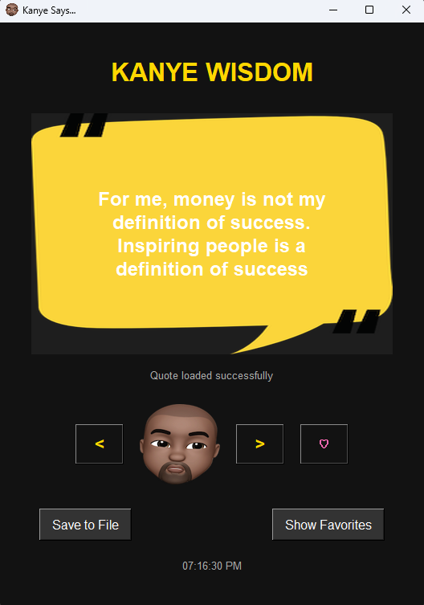

# Kanye Says 🎤

Welcome to **Kanye Says**, a fun little app that fetches random quotes from the legendary Kanye West! 🚀 This project is built using Python's `tkinter` for the GUI and the `requests` library to interact with the [Kanye.rest API](https://kanye.rest/).

---

## Features ✨

- **Random Kanye Quotes**: Click the Kanye button to get a fresh quote from the man himself. 🎤
- **Beautiful UI**: A clean and simple interface with a background image and Kanye's iconic face as the button. 🎨
- **Easy to Use**: Just click the button, and Kanye will share his wisdom with you. 🖱️

---

## Screenshot 📸



---

## How to Run 🛠️

1. **Clone the Repository**:
   ```bash
   git clone https://github.com/your-repo/kanye-says.git
   cd kanye-says
   ```
2. **Install Dependencies**:
   Make sure you have Python installed. Then, install the required library:

   ```bash
   pip install requests
   ```
3. **Run the Application**:
   ```bash
   python main.py
   ```
4. **Enjoy!** 🎉
   
   Click the Kanye button to get your daily dose of Kanye wisdom.


## Contributors 👥
A big shoutout to the amazing contributors who made this project possible! 🙌

- [harrym9](https://github.com/harrym9) :Backend Developer 💻
- [MYounesEg](https://github.com/MYounesEG) : Frontend Developer, Readme.md 🎨

## Acknowledgments 🙏

- Thanks to Kanye.rest for providing the API.

- Thanks to Kanye West for being an endless source of inspiration (and quotes). 🌟


Enjoy the app, and remember: "I'm a creative genius, and I'm gonna express myself." – Kanye West 🎤
